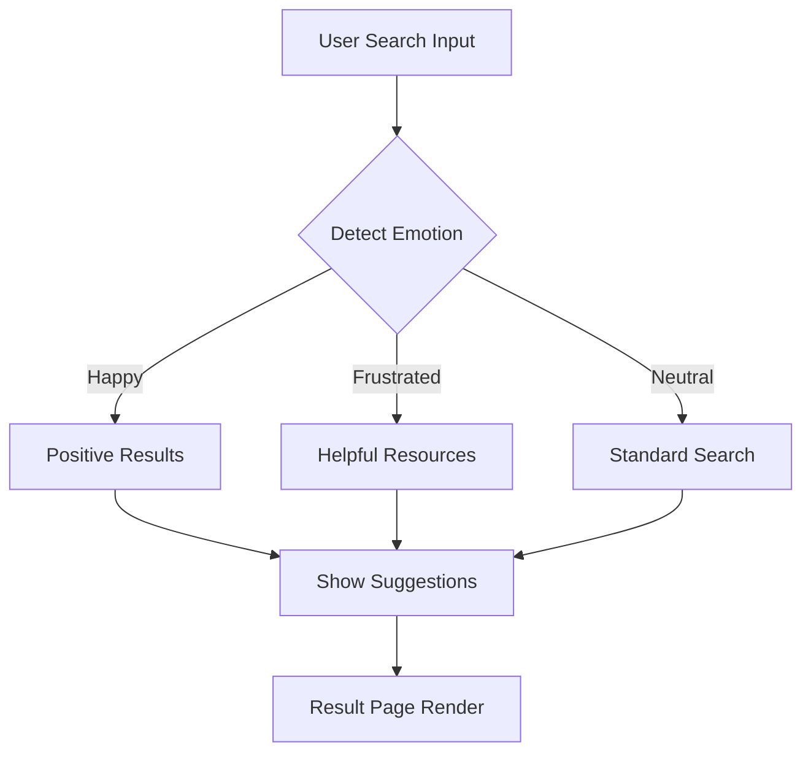

<div align="center">

# 🌟 FeelSearch — Redefining Search with Emotion + Intelligence


🎯 **FeelSearch** is an innovative platform that uses **emotion-aware algorithms** to deliver smarter, more personal search results — built for productivity in universities, schools, and workplaces.


</div>

---

## 🚀 Why FeelSearch?

🔍 Unlike traditional search engines, **FeelSearch** understands **context and emotion**, ensuring the most relevant, helpful, and empathetic results — whether you're a student, developer, or professional.

> "What if your search engine could feel your needs before you typed? That’s FeelSearch."

---

## 🧠 Key Features

- 🎭 **Emotion-Based Search** – Works on built-in and text-based emotion detection
- 🌐 **Cross-Platform** – Works seamlessly on PC, Mac, tablets, and mobile
- 💡 **Smart Suggestions** – Recommends productivity tools and educational resources
- 🪄 **Intuitive UI/UX** – Sleek design with real-time feedback
- 🔐 **Built with Privacy** – Data-secure, scalable architecture

> ⚠️ **Note:** At the moment, FeelSearch is working without a database as we are developing a **face detection–based user security module**. This ensures enhanced protection and emotion recognition. Database integration will be added soon.

---

## 📽 Live Demo (Testing Phase)

> 🚀 [Click to Try FeelSearch (Testing)](https://v0-feelsearch-concept.vercel.app/) *(Work in progress)*


---

## 🔧 Project Workflow




---
```
FeelSearch/
├── public/                # Static assets like favicon, index.html
├── src/                   # Core app source
│   ├── components/        # Reusable UI components (search bar, results card, etc.)
│   ├── pages/             # Pages like Home, About, Features, etc.
│   ├── services/          # API logic and handlers (emotion engine, etc.)
│   ├── styles/            # SCSS/CSS styles
│   └── main.tsx           # Entry point of the frontend (React or Angular)
├── .gitignore
├── README.md
├── LICENSE.md
├── package.json
└── tsconfig.json
```
---

## 🛠️ Getting Started

### Prerequisites

- Node.js / .NET SDK
- Angular / React CLI
- MySQL / MongoDB / SQL Server *(for future use)*
- Visual Studio Code / Visual Studio

### Installation

```bash
# Clone the repository
git clone https://github.com/ZainulabdeenOfficial/FeelSearch.git
cd FeelSearch

# Install dependencies
cd backend && npm install
cd ../frontend && npm install
```

---

## ⚙️ Run the Project

```bash
# Backend
cd backend
npm start

# Frontend
cd ../frontend
ng serve --open
```

> ✅ Note: Database not required at this time

---

## 💡 Real-World Use Cases

- 👩‍🏫 **Students**: Discover educational tools aligned with your mood
- 🧑‍💻 **Professionals**: Find productivity apps that match your current workload
- 🏠 **Casual Users**: Get fun and helpful suggestions based on how you feel

---

## 🤝 Contribute Like a Pro

We welcome **collaborators**, **designers**, **devs**, and **testers**!

### Steps to Contribute:

1. 🍴 Fork the repo
2. 🧪 Create your branch (`git checkout -b feature/cool-feature`)
3. 💾 Commit your changes (`git commit -m 'Add cool feature'`)
4. 🚀 Push to your fork (`git push origin feature/cool-feature`)
5. 📬 Open a pull request & wait for the magic 🪄

### Want to Get Involved?
Check our [issues](https://github.com/ZainulabdeenOfficial/FeelSearch/issues) tab for tasks labeled **good first issue**.

---

## 📣 Join the Community

Connect with like-minded devs, get help, and showcase your contributions:

- GitHub: [@ZainulabdeenOfficial](https://github.com/ZainulabdeenOfficial)
- LinkedIn: [Zain Ul Abdeen](https://www.linkedin.com/in/zainulabdeenofficial/)
- Email: zu4425@gmail.com

---

## 📜 License

This project is **not open-source** and is distributed under a **proprietary license**.

> © 2025 Zain Ul Abdeen. All rights reserved.  
> You may not copy, distribute, modify, or use this codebase in any form without explicit written permission from the author.

---

<div align="center">

🔥 **If you like this project, give it a ⭐ and share it with friends!** 🔥

</div>

